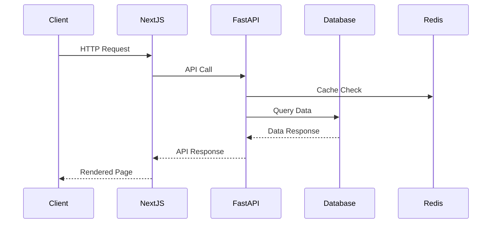

<div align="center">
# 🌸 FlowerMarket.io

[](https://nextjs.org/)
[](https://www.typescriptlang.org/)
[](https://www.python.org/)
[](https://fastapi.tiangolo.com/)
[](https://www.postgresql.org/)

*Your Premier Digital Flower Marketplace - Bringing Beauty to Your Doorstep* 🚪

[Live Demo](https://flowermarket.io) • [Documentation](https://docs.flowermarket.io) • [Report Bug](https://github.com/yourusername/flowermarket/issues) • [Request Feature](https://github.com/yourusername/flowermarket/issues)

</div>
<div></div>
## 🚀 Tech Stack

### Frontend
- **Next.js** - React framework for production
- **TypeScript** - For type-safe code
- **Bootstrap 5** - For responsive UI components
- **Redux** - For responsive Global State Manangement

### Backend
- **Python** - Core backend language
- **FastAPI** - Modern, fast web framework
- **OAuth2** - Secure authentication
- **ORM** - Database abstraction layer
- **PostgreSQL** - Robust relational database


  ## 📊 Architecture



## 🛠️ Quick Setup

### Prerequisites
- Node.js (v14 or higher)
- npm (v6 or higher)
- Python (v3.8 or higher)
- PostgreSQL

### Installation Steps

1. Clone the repository
```bash
git clone https://github.com/yourusername/flowermarket.git
```

2. Navigate to project directory
```bash
cd flowermarket
```

3. Install dependencies
```bash
npm install
```

4. Start development server
```bash
npm run dev
```

5. Open your browser and visit `http://localhost:3000`


## 💬 Feedback

Your feedback helps us grow! Please share your thoughts and suggestions using the comment form on our homepage.

## 🌟 Features
- Real-time flower inventory
- Secure payment processing
- User authentication
- Responsive design
- Order tracking

## 📝 Contributing
We welcome contributions! Please feel free to submit a Pull Request.

## 📄 License
This project is licensed under the MIT License - see the LICENSE file for details.

## 🤝 Support
For support, email support@flowermarket.io or join our Discord community.
</div>
<div align="center">
---

### Built with 💝 by the FlowerMarket Team

[Website](https://flowermarket.io) • [Documentation](https://docs.flowermarket.io) • [Blog](https://blog.flowermarket.io)

<sub>Powered by Next.js, FastAPI, and lots of ☕</sub>
---
</div>
