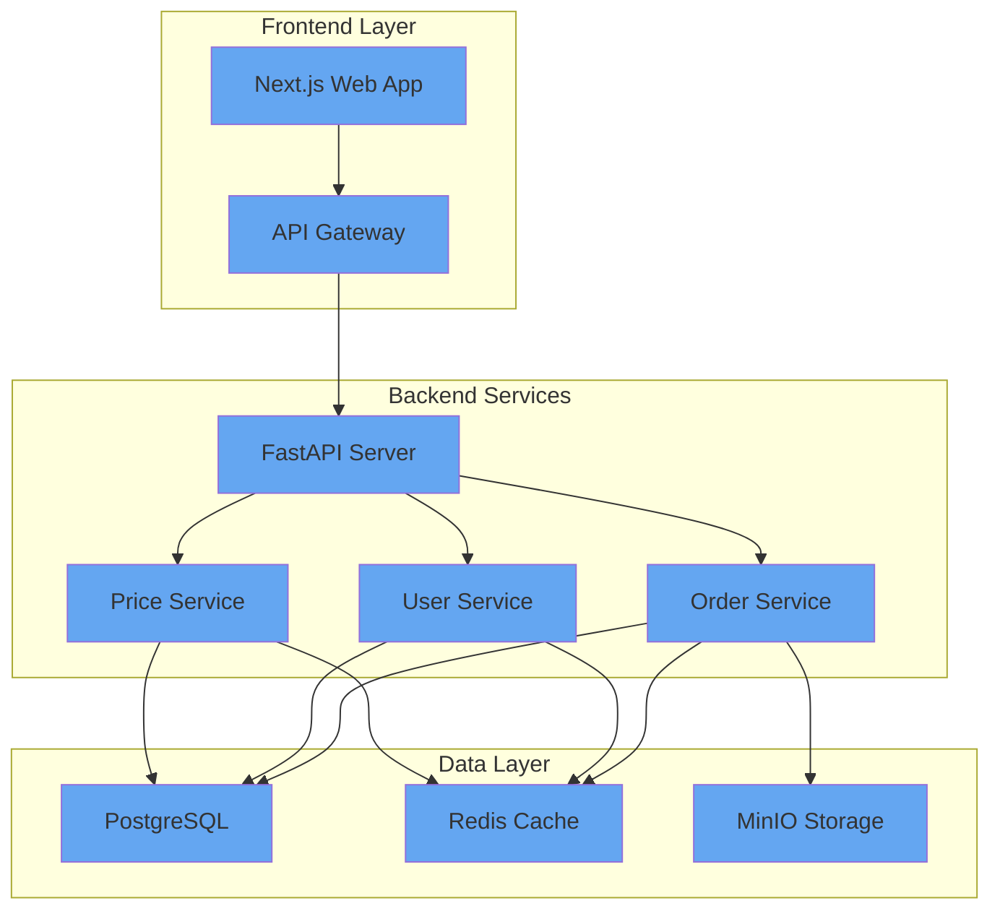
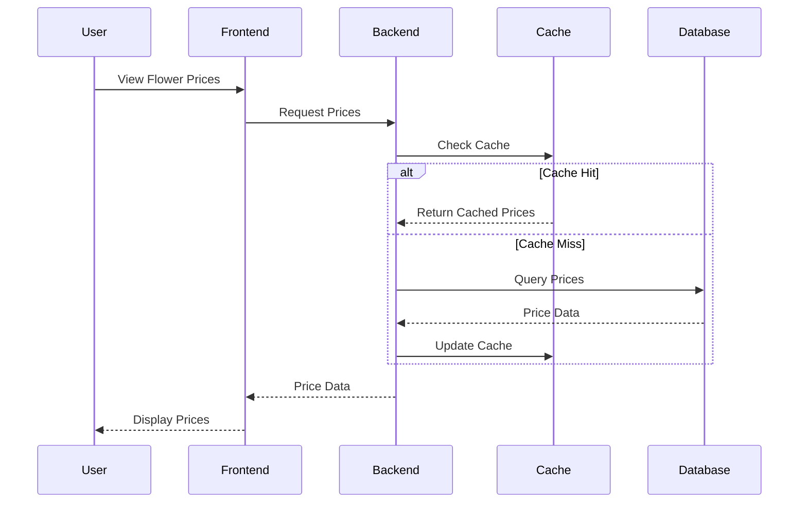
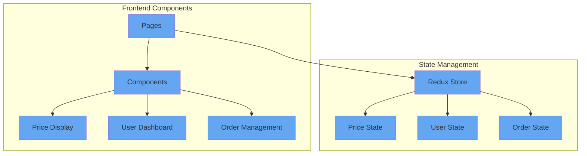
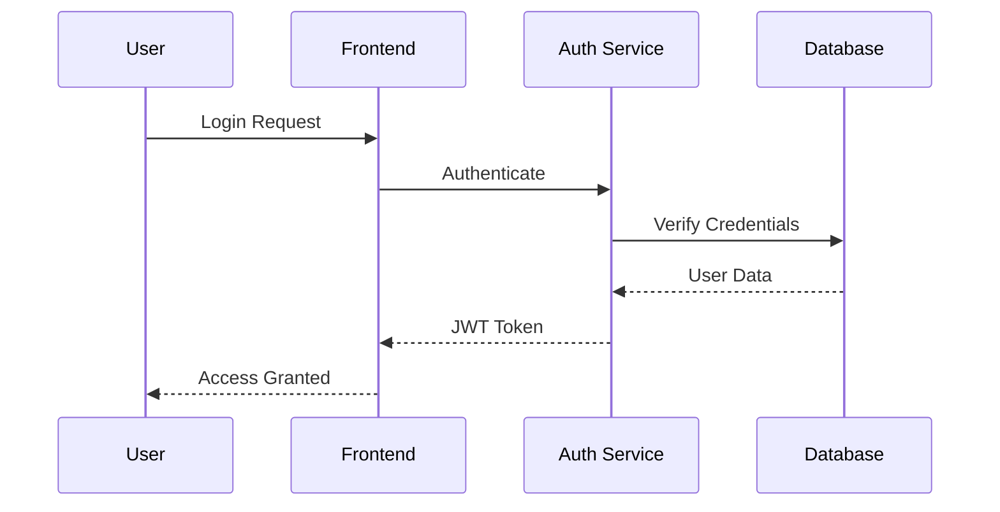
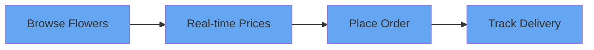
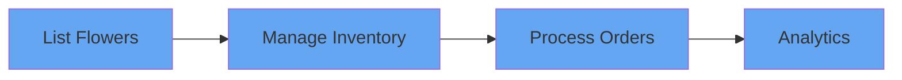
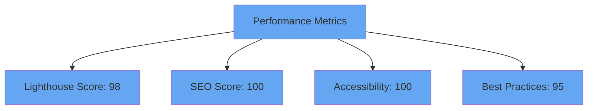
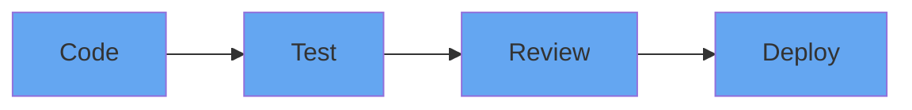
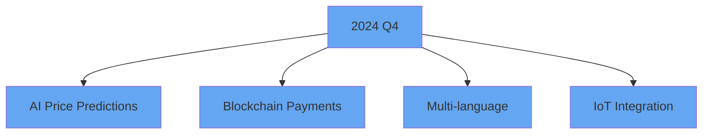

# 🌸 FlowerMarket.io

<div align="center">


*Modern Flower Market Platform with Real-time Updates*

[]()
[]()
[]()
[]()

</div>

## 🏗️ System Architecture



## 🔄 Real-time Price Update Flow



## 📱 Application Components



## 📁 Project Structure
```
FlowerMarket.io/
├── frontend/                # Next.js Frontend
│   ├── app/                # App Router Pages
│   ├── components/         # React Components
│   └── store/             # Redux Store
├── backend/                # FastAPI Backend
│   ├── services/          # Business Logic
│   ├── models/            # Data Models
│   └── api/               # API Routes
└── infrastructure/        # Docker & Deploy Configs
```

## 🔒 Authentication Flow



## 🚀 Quick Start

```bash
# Clone and setup
git clone https://github.com/flowermarket/platform
cd platform

# Development
docker-compose up

# Production
docker-compose -f deploy-docker-compose.yml up
```

## 🔑 Key Features

### For Buyers


### For Sellers


## 📈 Performance Metrics



## 🔄 Development Workflow



## 🌟 Future Roadmap



## 📞 Support

- Email: alpahamoris45@gmail.com


---

<div align="center">

*Building the future of flower trading, one bloom at a time* 🌸

</div>
